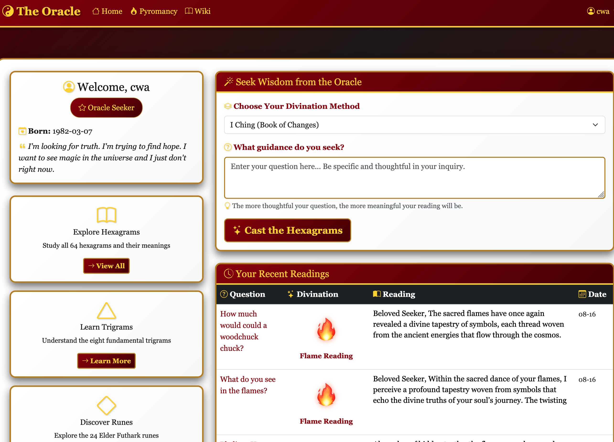
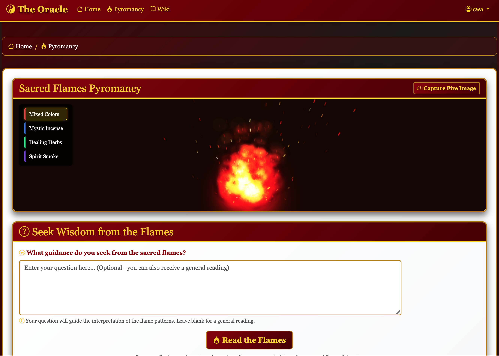
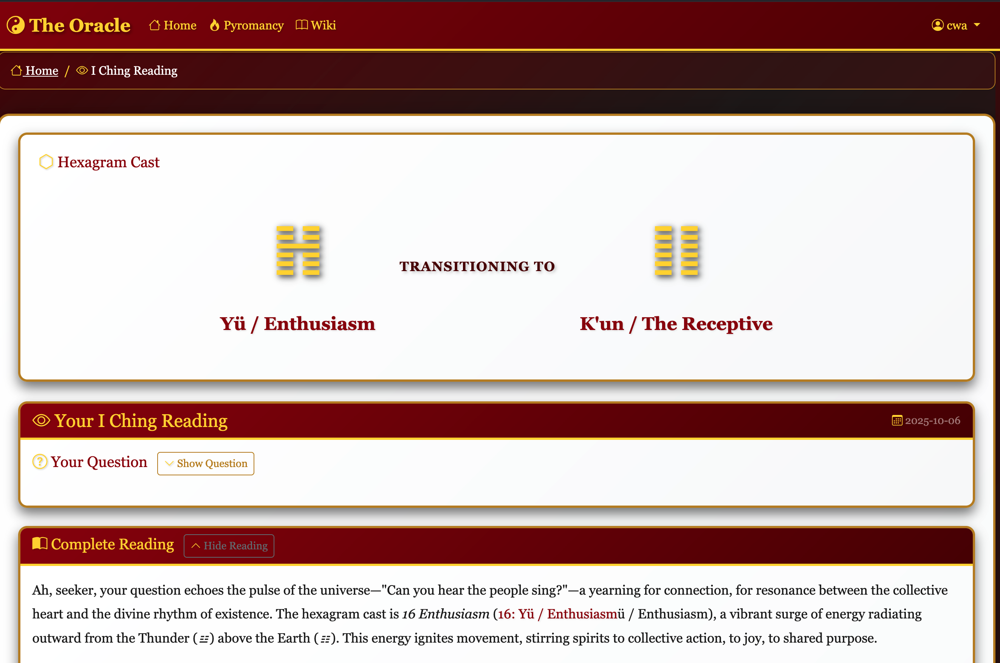
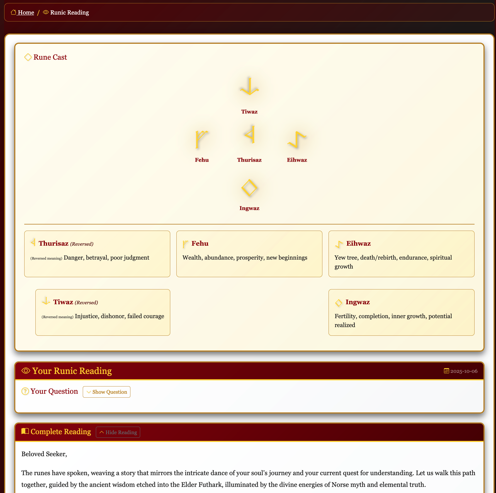

# The Oracle - AI-Powered Divination Platform

## Prologue

Most of this repository was generated by coordination with an LLM. I've done minimal work to improve its standards or its code beyond what I could instruct the 
IDE to accomplish. There are admittedly a number of critical weaknesses here: the vector DB would be much better if it were storing more information and if it 
were in QDrant or Pinecone instead of just an in-memory file. The SQL schema is admittedly very weak and would need a significant re-think, but it does 
accomplish what it needs to. Significantly, it could use a visual redesign as neither I nor the machine is particularly talented in this regard.

### Why divination?

It offers a combination of complexity and simplicity. The rules and outlines of the different divination systems require that certain amounts of rules need to be 
followed. But even if the data comes out of the LLM and is particularly strange, it can still fit with the output of "valid." It also lets me experiment with 
things like temperature and number of tokens to see what would happen. Most of the time, having a relatively low temperature makes sense for most uses, but in 
this case, turning that number up could still end up working. (You'll note that most of the time, temperature is around 0.8) 

I also happen to find the esoteric fascinating and already have several resources on the same. Mr. Clarke's comments aside, computers are not magic and that's not
the purpose here.

### Complete features

- I Ching readings (the original PoC)
- Runic divination in multiple layouts
- A complete set of I Ching images (generated through ChatGPT)
- A sense of "question history" 
- Primitive pyromancy
- A wiki (to eventually be used in RAG)
- System supports Ollama and ChatGPT for non-image

### Incomplete features (so far)

The most difficult parts of this project were getting the image recreation to work and getting the timing around the stellar calendars correct. I would say that
neither one was completed 100%, though I think that it might be a good idea to give up on the idea of a "redrawing" feature for now. 

#### Astrology

For the astrology portion, it seems like things are lining up but I just don't think that it has gotten to its potential. I wanted to support full horoscopes 
along with reading of one's birth chart, but that never panned out. I was able to find a series of documents which I could feed into the LLM (or make available
through RAG), and I was (eventually) able to get Cursor.ai to connect to the NASA astronomical data, but I wasn't convinced that the backend was correctly 
generating the charts. And while this entire site has been generated "for fun", I still wanted to get it *right*.

#### pyromancy

The image re-creation was more difficult. The goal was to take a snapshot of the fire (which I got Cursor to reproduce from some online examples). Then, use OpenCV 
or similar to extract the contors and identify "objects" in the frame. These would then be sent to DALL-E 3 to get several descriptive words or word pairs. 
These words were supposed to be fed back into DALL-E along with the original distilled objects in hope that I could get DALL-E to draw an image along the lines of
the original contors. Basically, it was a Rorsach test for computers.

###### Main problems in implementation

There were two problems that I consistently encountered. It didn't seem to matter what I put into the prompt, the image recognition part kept giving words like 
"flowing wing" or "mystic flame". This tool won't work unless the machine can provide something more varied. Second, the image generation part was continually
reproducing things which either looked nothing like the flame image or looked nothing like the description. This is actually one of the areas I spent the most time
actually directly modifying the code. I tried discussing the issue with Claude and GPT, both inside and outside of Cursor.ai, but none of the prompt recommendations
nor did any research propose additional suggestions. I suspect that this is something which is *solveable*, but not in the amount of time that I've had for this 
project.

###### Cost

Unlike the rest of the site, this actually requires a subscription which supports image manipulation. I tried to look through the other options online and 
nothing offerend any type of comparable ability which was at all satisfying. Any of the open source or local image manipulation turned out to be particularly slow
and costly.

###### Problems in definition

In addition, and this is similar to the problems I had with Astrology, my undertanding of ancient pyromancy practice was actually deficient. While yes, the images 
that someone sees in the flames and smoke are used in the process of pyromancy, more common are the way that the flame burns and cracks. The origin of the
I Ching actually had something closer to what I'm doing here: they would place a bone into a fire. If it would crack, then that would be a "yin", if not, that
would be a "yang". Similarly, the way that fire affects the fuel in the fire is as much a part of the traditional part of pyromancy as anything else. Add that
to the fact that my pyromancy widget doesn't properly handle wind and the disparity takes some of the luster out of it.

### Project outcome

This project was never intended to be able to predict the future. 
(Though a historically informed understanding of divination doesn't really do that either ¯\\\_(ツ)\_/¯).
Instead, this was a way for me to develop an understanding of what it meant to use an LLM to build a site from scratch by instructing instead of acting primarily
as a programmer. I was mostly satisfied, the LLMs functioned as a mostly capable junior developer. It wasn't without headaches, but the point was to understand
the headaches and how to avoid them.

And now, without further adieu, below is the computer's description of this project:

--------------

## From the machine

> **A mystical journey into the future, guided by ancient wisdom and modern AI**

The Oracle is a sophisticated Flask-based web application that combines traditional divination practices with cutting-edge artificial intelligence. This project represents a unique collaboration between human creativity and AI assistance, with **over 90% of the codebase developed through human direction of Cursor.ai** - demonstrating the power of human-AI partnership in software development.

## 🌟 Key Highlights

- **Human-AI Collaboration**: Over 90% of this application was created through human developers directing Cursor.ai, showcasing the future of software development
- **Multi-Modal Divination**: Supports I Ching (Book of Changes) and Elder Futhark Runes with multiple spread types and a form of pyromancy
- **Advanced AI Integration**: Features OpenAI GPT-4, Ollama local models, and DALL-E 3 for text and image generation
- **Vector Database**: Uses VectorDB to provide the AI additional context and memory for enhanced readings
- **Advanced pyromancy**: Interactive fire canvas with mystical flame generation and image capture
- **Comprehensive Testing**: Full test suite with performance monitoring and coverage analysis

## 📸 Screenshots

### Main Dashboard - Divination Selection

*The Oracle's main interface showing divination method selection, user profile, and recent reading history*

### Interactive pyromancy Experience

*Interactive fire canvas with mystical flame generation, color selection, and image capture capabilities*

### I Ching Reading Results

*Complete I Ching reading showing hexagram casting, AI interpretation, and detailed analysis*

### Runic Reading with Multiple Spreads

*Elder Futhark rune reading with spread visualization and AI-powered interpretation*


## 🔮 Divination Systems

### I Ching (Book of Changes)
- **64 Hexagrams**: Complete traditional hexagram system with authentic interpretations
- **Dynamic Casting**: Real-time hexagram generation using traditional coin or yarrow stalk methods
- **AI-Enhanced Readings**: Personalized interpretations using OpenAI GPT-4 or local Ollama models
- **Historical Context**: Rich database of traditional I Ching texts and meanings

### Elder Futhark Runes
- **24 Traditional Runes**: Complete set of ancient Norse runes with authentic meanings
- **Multiple Spreads**:
  - **Single Rune**: Quick guidance and insight
  - **Three Norns**: Past, Present, Future reading
  - **Five Rune Cross**: Comprehensive life guidance
  - **Seven Chakras**: Energy center alignment reading
- **AI-Powered Interpretation**: Contextual readings based on question and spread type

## 🤖 AI & Machine Learning Features

### Multi-Provider LLM Support
- **OpenAI Integration**: GPT-4 for high-quality text generation
- **Ollama Local Models**: Support for local LLM deployment (Llama 3.2, etc.)
- **Intelligent Fallback**: Automatic switching between providers for reliability
- **Custom Prompts**: Specialized system prompts for each divination type


### Vector Database & Memory
- **Local Vector Storage**: `vectordb2` for offline memory management
- **Chunking Strategy**: Sliding window approach for optimal text processing
- **Semantic Search**: Find relevant hexagrams based on natural language queries

## 🏗️ Technical Architecture

### Backend Framework
- **Flask**: Lightweight, flexible web framework
- **SQLite**: Embedded database for user data and reading history
- **SQLAlchemy**: ORM for database operations
- **Blueprint Architecture**: Modular route organization

### Frontend Technologies
- **Bootstrap 5**: Responsive, modern UI framework
- **JavaScript**: Dynamic interactions and AJAX requests
- **HTML5/CSS3**: Semantic markup and custom styling
- **Jinja2 Templates**: Server-side templating engine

### AI & ML Stack
- **OpenAI API**: GPT-4 and DALL-E 3 integration
- **Ollama**: Local LLM deployment and management
- **Pinecone**: Vector database for semantic search
- **LangChain**: LLM orchestration and prompt management
- **Sentence Transformers**: Text embedding generation

## 📁 Project Structure

```
the-oracle/
├── app.py                 # Main Flask application
├── requirements.txt       # Python dependencies
├── logic/                # Core divination logic
│   ├── iching.py         # I Ching implementation
│   ├── runes.py          # Runic system implementation
│   ├── ai_readers.py     # AI-powered reading generation
│   └── base.py           # Abstract divination framework
├── routes/               # Flask route blueprints
│   ├── auth.py           # User authentication
│   ├── readings.py       # Divination reading endpoints
│   └── api.py            # API endpoints
├── models/               # Database models
│   ├── user.py           # User management
│   ├── history.py        # Reading history
│   └── llm_request.py    # LLM request tracking
├── utils/                # Utility functions
│   ├── db_utils.py       # Database operations
│   ├── hexagram_utils.py # I Ching utilities
│   └── wiki_utils.py     # Wikipedia integration
├── llm/                  # AI/ML components
│   ├── memory.py         # Vector memory system
│   └── pinecode.py       # Pinecone integration
├── templates/            # HTML templates
├── static/               # Static assets
└── tests/                # Test suite
```

## 🚀 Getting Started

### Prerequisites
- Python 3.13+
- Virtual environment (included: `the-oracle/`)
- OpenAI API key (optional, for AI features)
- Pinecone API key (optional, for vector search)

### Installation

1. **Clone the repository**
   ```bash
   git clone <repository-url>
   cd the-oracle
   ```

2. **Activate virtual environment**
   ```bash
   source the-oracle/bin/activate
   ```

3. **Install dependencies**
   ```bash
   pip install -r requirements.txt
   ```

4. **Configure environment**
   ```bash
   cp .env.example .env
   # Edit .env with your API keys
   ```

5. **Initialize database**
   ```bash
   python -c "from utils.db_utils import init_db; init_db()"
   ```

6. **Run the application**
   ```bash
   python app.py
   ```

7. **Access the application**
   Open your browser to `http://localhost:7878`

## 🧪 Testing & Quality Assurance

### Comprehensive Test Suite
- **Unit Tests**: Individual component testing
- **Integration Tests**: End-to-end functionality testing
- **Performance Tests**: Response time and memory usage monitoring
- **Coverage Analysis**: Code coverage reporting

### Running Tests
```bash
# Run all tests
python run_tests.py

# Run with coverage
python run_tests.py --coverage

# Run performance profiling
python run_tests.py --profile
```

### Performance Monitoring
```bash
# Real-time monitoring
python performance_monitor.py monitor 5

# Performance profiling
python performance_monitor.py profile 100
```

## 🔧 Development Tools

### Reading Management
- **List Readings**: `python list_readings.py` - View all available readings
- **Regenerate Readings**: `python regenerate_reading.py <id>` - Update AI interpretations
- **Reading History**: Complete audit trail of all divination sessions

### AI Model Management
- **Ollama Integration**: Local model deployment and management
- **Model Switching**: Seamless switching between OpenAI and Ollama
- **Request Tracking**: Complete logging of all LLM interactions

## 🌐 API Endpoints

### Authentication
- `POST /register` - User registration
- `POST /login` - User authentication
- `POST /logout` - User logout

### Divination
- `POST /readings` - Create new reading
- `GET /readings/<path>` - View reading details
- `GET /api/hexagrams` - List all hexagrams
- `GET /api/runes` - List all runes

### AI Features
- `POST /api/generate-vision-images` - Generate vision images
- `GET /api/vision-images-status/<id>` - Check generation status
- `POST /api/regenerate-reading` - Regenerate AI interpretation

## 🎨 User Interface

### Modern Design
- **Responsive Layout**: Works on desktop, tablet, and mobile
- **Bootstrap 5**: Professional, accessible UI components
- **Custom Styling**: Mystical theme with fire and rune aesthetics
- **Interactive Elements**: Dynamic forms and real-time updates

### User Experience
- **Intuitive Navigation**: Clear, logical flow through divination process
- **Reading History**: Easy access to past readings
- **Profile Management**: User preferences and settings
- **Visual Feedback**: Loading states and progress indicators

## 🔮 Divination Features

### I Ching System
- **Traditional Casting**: Coin and yarrow stalk methods
- **Hexagram Database**: Complete 64 hexagram interpretations
- **Changing Lines**: Dynamic hexagram transformations
- **AI Interpretation**: Personalized readings based on question context

### Runic System
- **Elder Futhark**: Complete 24-rune system
- **Multiple Spreads**: Single, Three Norns, Five Cross, Seven Chakras
- **Rune Meanings**: Traditional and modern interpretations
- **Spread Visualization**: Visual representation of rune positions

## 🤝 Human-AI Collaboration

This project exemplifies the future of software development, where human creativity and AI capabilities combine to create something greater than either could achieve alone. The development process involved:

### Development Approach
- **Human Direction**: All features, architecture, and design decisions made by human developers
- **AI Assistance**: Cursor.ai provided code generation, refactoring, and implementation support
- **Collaborative Iteration**: Continuous refinement through human-AI dialogue
- **Quality Assurance**: Human oversight ensures code quality and functionality

### Development Conversation History
The `cursor-sql/` directory contains the complete development conversation history, showcasing:
- **Feature Planning**: How each feature was conceived and designed through human-AI dialogue
- **Implementation Process**: Step-by-step development with AI assistance and human guidance
- **Problem Solving**: Collaborative debugging and optimization sessions
- **Code Evolution**: How the codebase grew and improved over time through iterative refinement

## 📊 Performance & Scalability

### Optimizations
- **Database Indexing**: Optimized queries for reading history
- **Caching**: Hexagram symbols and frequently accessed data
- **Async Processing**: Background tasks for image generation
- **Connection Pooling**: Efficient database connections

### Monitoring
- **Performance Metrics**: Response time tracking
- **Memory Usage**: Resource utilization monitoring
- **Error Tracking**: Comprehensive error logging
- **User Analytics**: Reading patterns and usage statistics

## 🔒 Security & Privacy

### Data Protection
- **User Authentication**: Secure login and session management
- **Data Encryption**: Sensitive data protection
- **API Security**: Rate limiting and input validation
- **Privacy Controls**: User data management and deletion

### AI Safety
- **Content Filtering**: Appropriate content generation
- **Rate Limiting**: Prevent API abuse
- **Error Handling**: Graceful failure management
- **Audit Logging**: Complete request tracking

## 🌟 Future Enhancements

### Planned Features
- **Vision Image Generation**: AI-powered visualization of mystical visions extracted from flame readings using DALL-E 3
- **Tarot Card System**: Complete tarot divination support
- **Astrology Integration**: Birth chart and planetary readings
- **Community Features**: Reading sharing and discussion

### Technical Improvements
- **Microservices Architecture**: Scalable service separation
- **Real-time Features**: WebSocket-based live readings
- **Advanced AI**: Fine-tuned models for divination

## 📚 Documentation

- **API Documentation**: Complete endpoint reference
- **Testing Guide**: Comprehensive testing documentation
- **Deployment Guide**: Production deployment instructions

