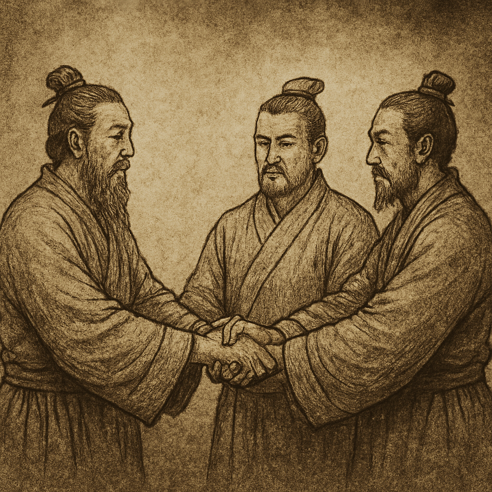
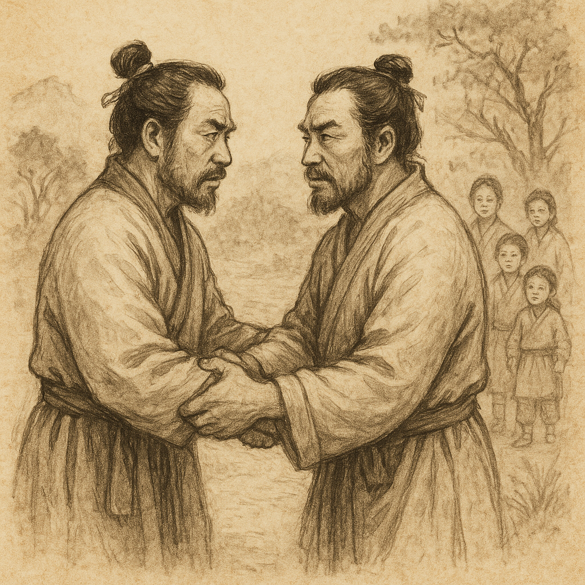
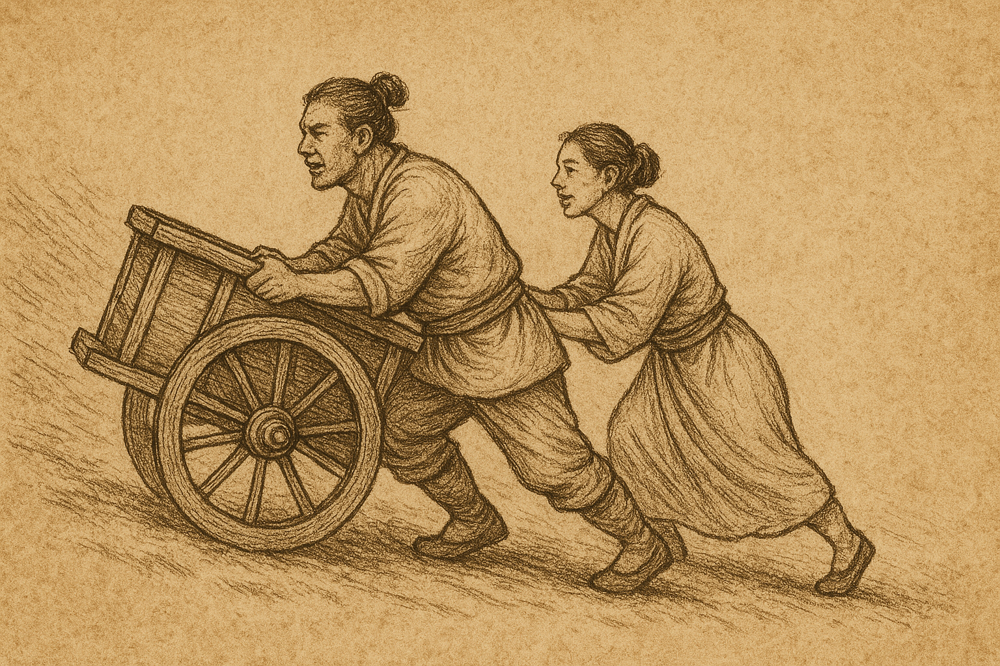

# I Ching Hexagram Images

This directory contains visual representations of all 64 hexagrams from the I Ching (Book of Changes). Each image was generated through AI to provide a visual interpretation of the traditional hexagram symbols and their meanings.

## The 64 Hexagrams

### 1. The Creative (Heaven) ䷀

**The Creative** - Represents pure yang energy, the power of creation, and the masculine principle. Symbolizes strength, leadership, and the beginning of all things.

### 2. The Receptive (Earth) ䷁

**The Receptive** - Represents pure yin energy, the power of receptivity, and the feminine principle. Symbolizes nurturing, support, and the foundation of all things.

### 3. Difficulty at the Beginning ䷂

**Difficulty at the Beginning** - Represents the challenges and obstacles that arise when starting new endeavors. Symbolizes perseverance through initial hardships.

### 4. Youthful Folly ䷃

**Youthful Folly** - Represents the innocence and inexperience of youth. Symbolizes the need for guidance and education in early stages of development.

### 5. Waiting ䷄

**Waiting** - Represents the virtue of patience and proper timing. Symbolizes the wisdom of waiting for the right moment to act.

### 6. Conflict ䷅

**Conflict** - Represents disputes, arguments, and legal battles. Symbolizes the need for justice and the resolution of differences.

### 7. The Army ䷆

**The Army** - Represents discipline, organization, and collective action. Symbolizes the power of unity and structured leadership.

### 8. Union ䷇

**Union** - Represents partnership, cooperation, and mutual support. Symbolizes the strength found in working together.

### 9. The Taming Power of the Small ䷈

**The Taming Power of the Small** - Represents gentle influence and subtle guidance. Symbolizes the power of small, consistent actions.

### 10. Treading ䷉

**Treading** - Represents careful progress and mindful steps. Symbolizes the importance of being cautious and respectful in one's journey.

### 11. Peace ䷊

**Peace** - Represents harmony, prosperity, and favorable conditions. Symbolizes the ideal state of balance and cooperation.

### 12. Standstill ䷋

**Standstill** - Represents stagnation, obstruction, and difficult times. Symbolizes the need to wait and not force progress.

### 13. Fellowship with Men ䷌

**Fellowship with Men** - Represents community, friendship, and social harmony. Symbolizes the importance of human relationships.

### 14. Great Possession ䷍

**Great Possession** - Represents abundance, wealth, and material success. Symbolizes the responsibility that comes with great resources.

### 15. Modesty ䷎

**Modesty** - Represents humility, simplicity, and the virtue of not seeking recognition. Symbolizes inner strength through humility.

### 16. Enthusiasm ䷏

**Enthusiasm** - Represents joy, inspiration, and creative energy. Symbolizes the power of positive motivation and excitement.

### 17. Following ䷐

**Following** - Represents adaptation, flexibility, and the wisdom of following natural flow. Symbolizes the art of being a good follower.

### 18. Work on What Has Been Spoiled ䷑

**Work on What Has Been Spoiled** - Represents correction, reform, and the healing of past mistakes. Symbolizes the opportunity for renewal.

### 19. Approach ䷒

**Approach** - Represents advancement, progress, and the coming of favorable times. Symbolizes the approach of positive change.

### 20. Contemplation ䷓

**Contemplation** - Represents observation, reflection, and the power of seeing clearly. Symbolizes the importance of understanding before acting.

### 21. Biting Through ䷔

**Biting Through** - Represents resolution, determination, and the ability to overcome obstacles. Symbolizes the power of decisive action.

### 22. Grace ䷕

**Grace** - Represents beauty, elegance, and the refinement of form. Symbolizes the importance of both substance and style.

### 23. Splitting Apart ䷖

**Splitting Apart** - Represents decay, disintegration, and the end of cycles. Symbolizes the natural process of decline and renewal.

### 24. Return ䷗

**Return** - Represents renewal, recovery, and the beginning of new cycles. Symbolizes the return of positive energy and hope.

### 25. Innocence ䷘

**Innocence** - Represents purity, simplicity, and natural goodness. Symbolizes the power of unspoiled nature and honest intentions.

### 26. The Taming Power of the Great ䷙

**The Taming Power of the Great** - Represents the influence of wisdom and experience. Symbolizes the power of accumulated knowledge.

### 27. The Corners of the Mouth ䷚

**The Corners of the Mouth** - Represents nourishment, both physical and spiritual. Symbolizes the importance of proper sustenance and care.

### 28. Preponderance of the Great ䷛

**Preponderance of the Great** - Represents excess, imbalance, and the need for correction. Symbolizes the danger of going too far.

### 29. The Abysmal Water ䷜

**The Abysmal Water** - Represents danger, difficulty, and the depths of challenge. Symbolizes the need for courage and persistence.

### 30. The Clinging Fire ䷝

**The Clinging Fire** - Represents clarity, illumination, and the power of insight. Symbolizes the light that reveals truth and understanding.

### 31. Influence ䷞

**Influence** - Represents attraction, magnetism, and the power of subtle influence. Symbolizes the natural force of attraction between things.

### 32. Duration ䷟

**Duration** - Represents persistence, endurance, and the power of lasting relationships. Symbolizes the strength found in consistency.

### 33. Retreat ䷠

**Retreat** - Represents withdrawal, strategic retreat, and the wisdom of knowing when to step back. Symbolizes the power of strategic withdrawal.

### 34. The Power of the Great ䷡

**The Power of the Great** - Represents strength, authority, and the power of leadership. Symbolizes the responsibility that comes with great power.

### 35. Progress ䷢

**Progress** - Represents advancement, growth, and the forward movement of life. Symbolizes the natural progression toward success.

### 36. Darkening of the Light ䷣

**Darkening of the Light** - Represents adversity, difficulty, and the need to maintain inner light during dark times. Symbolizes the power of inner strength.

### 37. The Family ䷤

**The Family** - Represents family relationships, domestic harmony, and the foundation of society. Symbolizes the importance of family bonds.

### 38. Opposition ䷥

**Opposition** - Represents conflict, disagreement, and the tension between different forces. Symbolizes the need to find common ground.

### 39. Obstruction ䷦

**Obstruction** - Represents obstacles, difficulties, and the challenges that block progress. Symbolizes the need for patience and perseverance.

### 40. Deliverance ䷧

**Deliverance** - Represents liberation, freedom, and the release from difficult situations. Symbolizes the joy of overcoming obstacles.

### 41. Decrease ䷨

**Decrease** - Represents reduction, simplification, and the wisdom of letting go. Symbolizes the power of voluntary limitation.

### 42. Increase ䷩

**Increase** - Represents growth, expansion, and the multiplication of positive forces. Symbolizes the natural process of growth and development.

### 43. Breakthrough ䷪

**Breakthrough** - Represents decisive action, determination, and the power to overcome resistance. Symbolizes the moment of breakthrough and success.

### 44. Coming to Meet ䷫

**Coming to Meet** - Represents encounter, meeting, and the coming together of different forces. Symbolizes the power of connection and relationship.

### 45. Gathering Together ䷬

**Gathering Together** - Represents assembly, community, and the power of collective action. Symbolizes the strength found in unity.

### 46. Pushing Upward ䷭

**Pushing Upward** - Represents growth, advancement, and the upward movement of life. Symbolizes the natural tendency toward growth and improvement.

### 47. Oppression ䷮

**Oppression** - Represents hardship, limitation, and the experience of being constrained. Symbolizes the need for inner strength during difficult times.

### 48. The Well ䷯

**The Well** - Represents the source of life, nourishment, and the foundation of community. Symbolizes the importance of shared resources and mutual support.

### 49. Revolution ䷰

**Revolution** - Represents change, transformation, and the breaking of old patterns. Symbolizes the power of radical change and renewal.

### 50. The Cauldron ䷱

**The Cauldron** - Represents transformation, refinement, and the process of creating something new. Symbolizes the power of transformation and renewal.

### 51. The Arousing Thunder ䷲

**The Arousing Thunder** - Represents awakening, shock, and the power of sudden change. Symbolizes the force that awakens and energizes.

### 52. Keeping Still ䷳

**Keeping Still** - Represents stillness, meditation, and the power of inner peace. Symbolizes the importance of quiet reflection and stability.

### 53. Development ䷴

**Development** - Represents gradual progress, steady growth, and the natural development of things. Symbolizes the power of patient, steady progress.

### 54. The Marrying Maiden ䷵

**The Marrying Maiden** - Represents relationships, partnerships, and the coming together of different elements. Symbolizes the importance of careful choice in relationships.

### 55. Abundance ䷶

**Abundance** - Represents fullness, prosperity, and the peak of success. Symbolizes the height of achievement and the responsibility it brings.

### 56. The Wanderer ䷷

**The Wanderer** - Represents travel, exploration, and the journey of life. Symbolizes the wisdom gained through experience and movement.

### 57. The Gentle Wind ䷸

**The Gentle Wind** - Represents subtle influence, penetration, and the power of gentle persistence. Symbolizes the strength of soft, consistent action.

### 58. The Joyous Lake ䷹

**The Joyous Lake** - Represents joy, celebration, and the pleasure of life. Symbolizes the importance of happiness and positive energy.

### 59. Dispersion ䷺

**Dispersion** - Represents scattering, release, and the breaking apart of rigid structures. Symbolizes the power of letting go and allowing natural flow.

### 60. Limitation ䷻

**Limitation** - Represents boundaries, discipline, and the wisdom of knowing limits. Symbolizes the power of self-restraint and proper boundaries.

### 61. Inner Truth ䷼

**Inner Truth** - Represents authenticity, sincerity, and the power of genuine truth. Symbolizes the importance of being true to oneself and others.

### 62. Small Exceeding ䷽

**Small Exceeding** - Represents attention to detail, precision, and the power of small things. Symbolizes the importance of careful attention and precision.

### 63. After Completion ䷾

**After Completion** - Represents the end of a cycle, completion, and the transition to new beginnings. Symbolizes the wisdom of knowing when something is finished.

### 64. Before Completion ䷿

**Before Completion** - Represents the final stage before completion, the last push, and the transition to a new cycle. Symbolizes the importance of finishing what has been started.

## Additional Images

### Mountains of China

A scenic representation of the Chinese landscape, symbolizing the connection between the I Ching and its cultural origins.

## About These Images

These hexagram images were generated using AI to provide visual interpretations of the traditional I Ching symbols. Each image captures the essence and meaning of its corresponding hexagram, offering a modern visual representation of these ancient symbols of wisdom.

The I Ching, or Book of Changes, is one of the oldest Chinese texts and has been used for divination and guidance for thousands of years. These 64 hexagrams represent all possible combinations of yin and yang lines, forming a complete system for understanding the patterns of change in the universe.

## Usage

These images are used throughout The Oracle application to:
- Provide visual representations of hexagrams in readings
- Enhance the user experience with meaningful imagery
- Connect the ancient wisdom of the I Ching with modern technology
- Support the divination and guidance features of the application

Each image is carefully crafted to reflect the traditional meanings and interpretations of its corresponding hexagram while providing a contemporary visual experience.
